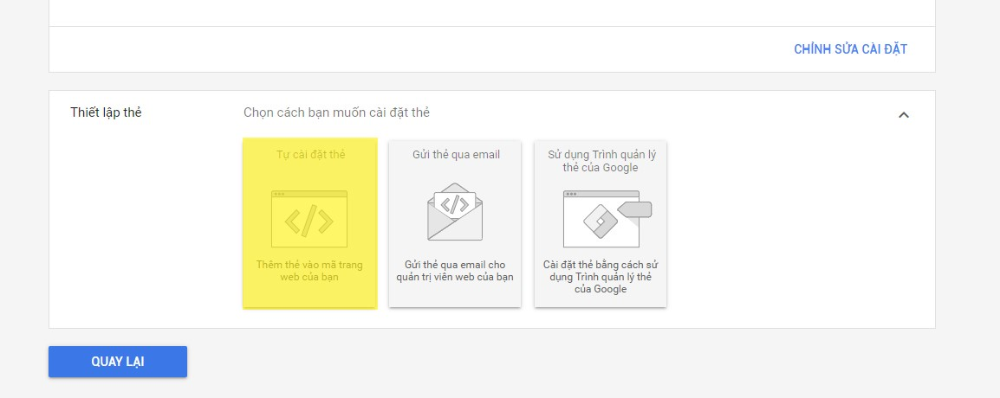
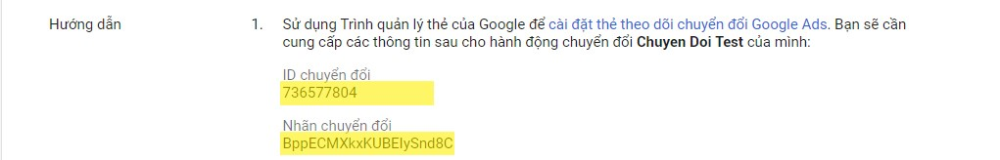
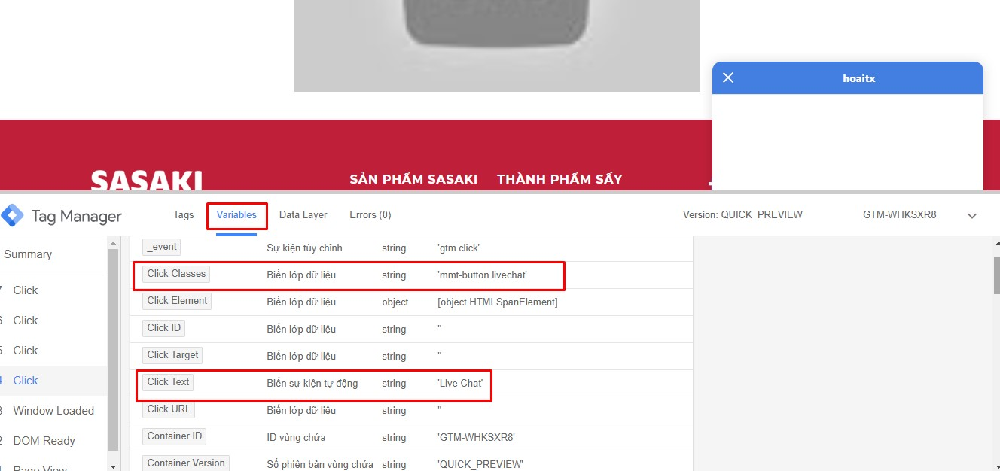
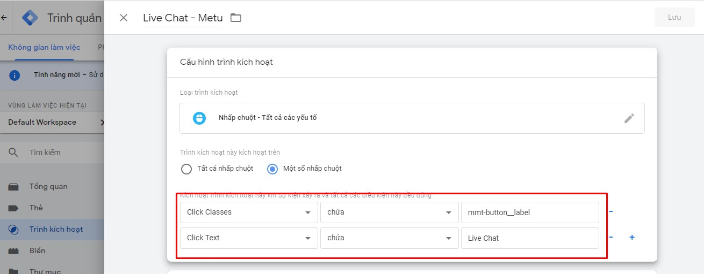
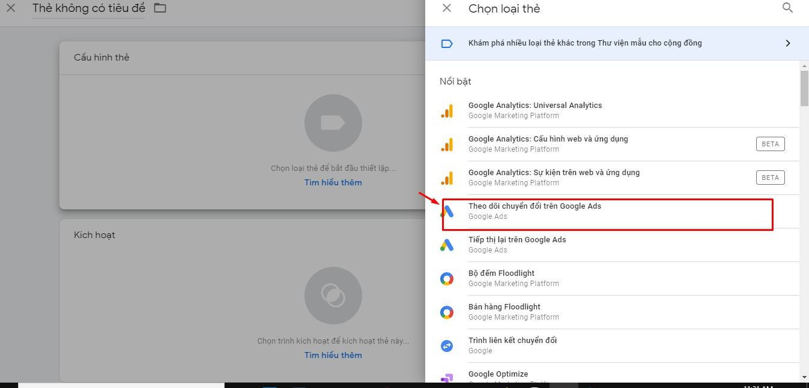
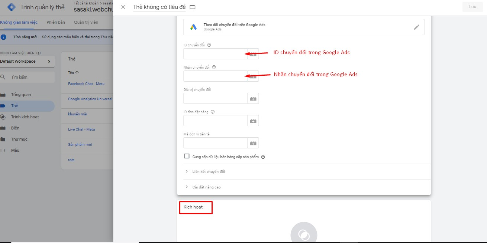

# Cách gắn mã chuyển đổi của Google Ads qua Google Tag Mananger

## Cách 1: Gắn mã thẻ trang web toàn cầu (gtag) của Google Ads qua Google Tag Mananer.

### Bước 1: Sau khi kết nối METU với tài khoản Google Ads thành công theo cách tự gắn thẻ gtag --> Đăng nhập tài khoản Google Tag Mananger.

### Bước 2: Chọn Thẻ --> Mới. 

### Bước 3: Điền tiêu đề thẻ --> Chọn icon hình cây bút.

.jpg>)

### Bước 4: Chọn HTML tùy chỉnh.

.jpg>)

### Bước 5: Nhập mã theo dõi thẻ trang web toàn cầu (gtag) --> Lưu.

.jpg>)

### Bước 6: Gửi. 

### Bước 7: Xuất bản --> Tiếp tục. 

## Cách 2: Gắn mã chuyển đổi cho từng nút của METU qua Google Tag Mananger.

### Bước 1: Sau khi kết nối METU với tài khoản Google Ads thành công theo cách tự gắn mã --> Trong tài khoản Google Ads, hãy nhấp vào trình đơn Công cụ và Cài đặt.

.jpg>)

### Bước 2: Chọn Đo lường: Chuyển đổi, thao tác này sẽ mở ra bảng Hành động chuyển đổi.

.jpg>)

### Bước 3: Chọn tên của hành động chuyển đổi mà bạn muốn gắn qua Google Tag Manager từ cột Hành động chuyển đổi.

.jpg>)

### Bước 4: Click vào mở rộng tab cho phần Thiết lập thẻ, rồi chọn Tự cài đặt thẻ.

.jpg>)

### Bước 5: Chọn tab Sử dụng thẻ Trình quản lý thẻ của Google.

.jpg>)

### Bước 6: Sao chép ID chuyển đổi và nhãn chuyển đổi gắn vào Goolge Tag Mananger.

### Bước 7: Truy cập vào tài khoản Google Tagmanager và tạo trình kích hoạt mới.

Lấy biến của hành động chuyển đổi trên trang web để đo hành động mà bạn muốn đo bằng cách sau: Ví dụ: Đo chuyển đổi Live Chat trên Metu với Google Tagmanager. Vào trang web click vào nút Live Chat trên trang web.

Sau đó sử dụng trình xem trước trong Google Tagmanager để lấy giá trị của nút (những giá trị này phải là những giá trị không đổi trong tất cả các lần click vào nút).

Vào tài khoản Google Tagmanager, thêm 2 biến vừa tìm được vào trình kích hoạt để đo chuyển đổi Live Chat như hình bên dưới.

### Bước 8: Tạo thẻ cho hành động chuyển đổi trong Google Tagmanager.

Bạn kích vào thẻ và nhấn thêm mới sau đó nhấn vào theo dõi chuyển đổi trên Google Ads.

Thêm ID chuyển đổi và nhãn chuyển đổi từ hành động mà bạn muốn đo chuyển đổi trong Google Ads. Sau đó chọn trình kích hoạt mà bạn vừa tạo cho hành động chuyển đổi này.

Sau khi hoàn thành xong nhớ ấn lưu và xuất bản thẻ và trình kích hoạt vừa tạo ra.
