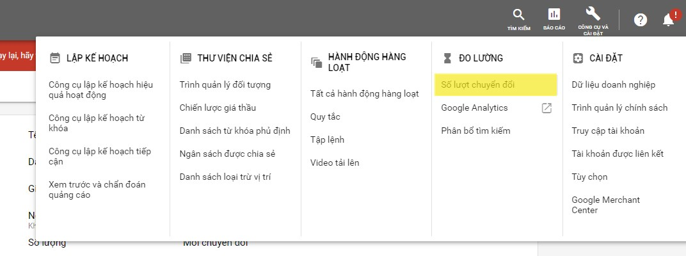

# Cách lấy mã chuyển đổi của tài khoản Google Ads

### Bước 1: Trong tài khoản Google Ads, hãy nhấp vào trình đơn Công cụ và Cài đặt.

.jpg>)

### Bước 2: Chọn Đo lường: Chuyển đổi, thao tác này sẽ mở ra bảng Hành động chuyển đổi.

### Bước 3: Chọn tên của hành động chuyển đổi bất kì từ cột Hành động chuyển đổi.

.jpg>)

### Bước 4: Click vào mở rộng tab cho phần Thiết lập thẻ, rồi chọn Tự cài đặt thẻ.

.jpg>)

.jpg>)

### Bước 5: Sao chép đoạn mã chuyển đổi gắn vào trong thẻ  trên website của bạn.

.jpg>)


Nếu đã cài đặt thẻ trang web toàn cầu (gtag) trên trang web của mình từ một sản phẩm khác của Google (ví dụ: Google Analytics) hoặc từ tài khoản Google Ads khác: Nếu chọn tùy chọn này, bạn sẽ không phải thêm lại thẻ trang web toàn cầu (gtag) vào trang web của mình nữa; tuy nhiên, để tính năng theo dõi chuyển đổi hoạt động cho tài khoản này, bạn cần phải thêm lệnh config (đoạn mã chứa ID chuyển đổi của bạn) vào mọi bản sao của thẻ trang web toàn cầu. Tùy chọn này hiển thị lệnh đó, trong đó “AW-CONVERSION\_ID” là ID chuyển đổi cho tài khoản của bạn:

gtag('config', 'AW-CONVERSION\_ID');


