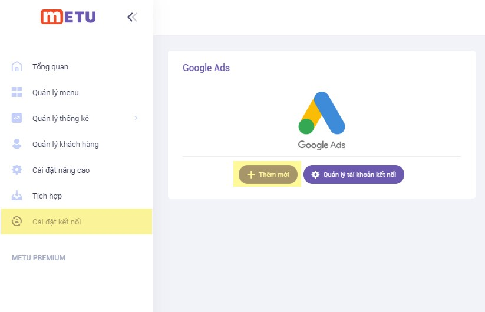
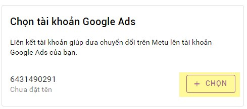
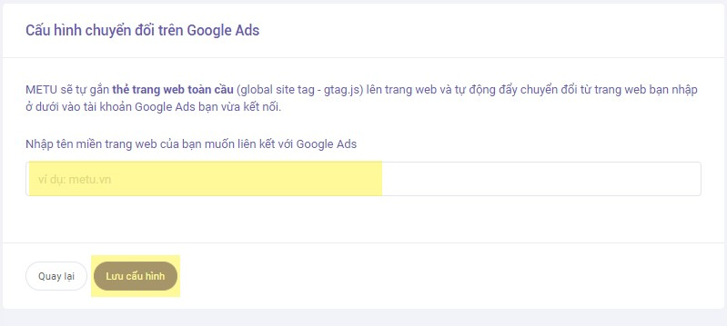

# Kết nối METU với tài khoản Google Ads

### Bước 1: Đăng nhập vào admin METU.

### Bước 2: Vào Cài đặt kết nối --> Thêm mới.

### Bước 3: Chọn Tài khoản --> Cho phép --> Chọn tài khoản Adwords.

.jpg>)

.jpg>)

### Bước 4: Đến bước này bạn sẽ có 2 lựa chọn là “Tôi chưa gắn thẻ gtag.js” và “Tôi đã gắn thẻ gtag.js”.

.jpg>)

Trường hợp chọn “Tôi chưa gắn thẻ gtag.js”: METU sẽ tự gắn thẻ trang web toàn cầu (global site tag - gtag.js) lên trang web và tự động đẩy chuyển đổi từ trang web bạn. Bạn chỉ cần nhập tên miền website của bạn à Lưu cấu hình (Ví dụ: sasaki.com), thì METU sẽ tự động đẩy chuyển đổi lên tài khoản Google Ads của bạn.

Trường hợp chọn “Tôi đã gắn thẻ gtag.js”: Sau khi bạn tự gắn thẻ trang web toàn cầu (global site tag - gtag.js) lên trang web bạn chỉ cần nhập tên miền website của bạn à Lưu cấu hình (Ví dụ: sasaki.com), thì METU sẽ tự động đẩy chuyển đổi lên tài khoản Google Ads của bạn.

.jpg>)
