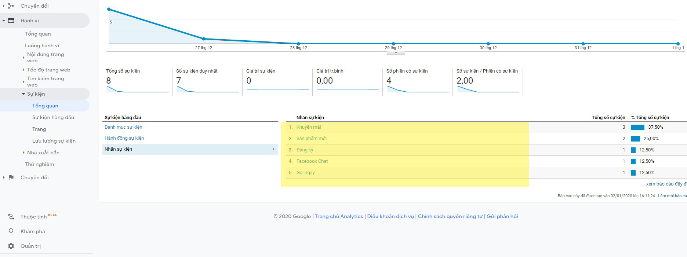

# Tạo tệp Goal Analytics với các tương tác từ METU

### Sau khi kết nối thành công METU với tài khoản Google Analytics thì METU sẽ sinh ra danh mục sự kiện của METU (Nhãn sự kiện và hành động sự kiện), chúng ta phải nhớ các phần này để copy vào các trường khi tạo mục tiêu (GOAL).

.jpg>)

.jpg>)

### Bước 1: Quản trị --> Mục tiêu --> + Mục tiêu mới.

.jpg>)

### Bước 2: Tick tùy chỉnh --> Tiếp tục.

.jpg>)

### Bước 3: Copy 1 tên mã sự kiện ở trên vào trường tên --> Tick sự kiện --> Tiếp tục.

.jpg>)

### Bước 4: Copy đúng danh mục sự kiện, hành động sự kiện và nhãn sự kiện đã nêu ở trên vào các trường --> Lưu.

.jpg>)

### Bước 5: Mục tiêu thêm mới thành công.

.jpg>)
