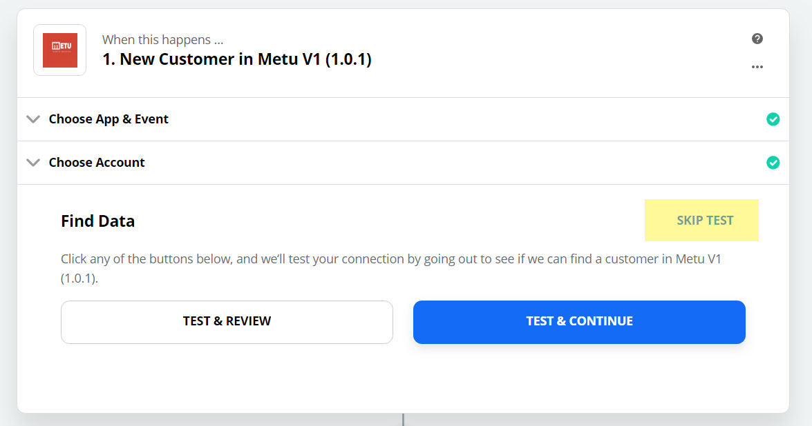
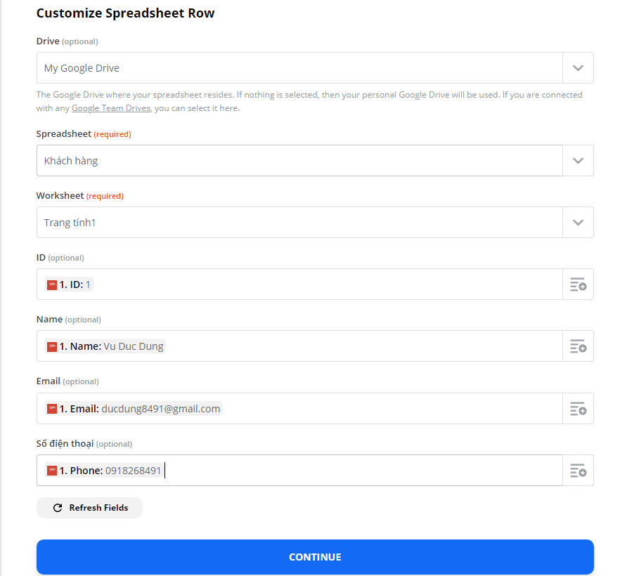

# Kết nối METU với Zapier

### Bước 1: Đăng nhập vào admin METU --> Cài đặt kết nối --> Kết nối Zapier.

.jpg>)

### Bước 2: Tạo tài khoản và đăng nhập Zapier.

### Bước 3: Chọn Accept invite & Build a Zap.

.jpg>)

### Bước 4: Chọn Make a Zap để tạo Zap mới.

.jpg>)

### Bước 5: Search metu --> Chọn bản Metu V1 (1.0.1).

.jpg>)

### Bước 6: Chọn CONTINUE.

.jpg>)

### Bước 7: Chọn Sign in to Metu V1 (1.0.1).

.jpg>)

### Bước 8: Sau khi chọn Sign in to Metu V1 (1.0.1) thì hiện ra Popup điền Token --> Admin METU click vào lấy Token kết nối.

.jpg>)

### Bước 9: Copy mã Token.

.jpg>)

### Bước 10: Copy mã Token vào popup Token của Zapier --> Yes, Continue.

.jpg>)

### Bước 11: Chọn CONTINUE.

.jpg>)

### Bước 12: Chọn SKIP TEST.

### Bước 13: Chọn App cần kết nối với METU (Ví dụ ở đây chọn Google Sheets).

.jpg>)

### Bước 14: Trường Choose Action Event chọn Greate Spreadsheet Row --> CONTINUE.

.jpg>)

### Bước 15: Chọn Account Google Sheets tương ứng --> CONTINUE.

.jpg>)

### Bước 16: Đến bước này chúng ta cần vào tài khoản Drive vừa Sign in tạo 1 file Google Sheet để chuyển dữ liệu sang và tạo ra các cột định danh để truyền dữ liệu từ METU vào. Ví dụ ở đây mình tạo 4 cột là: ID, Name, Email, Số điện thoại thì tất cả các dữ liệu khách hàng gửi như Form để lại Email, Số điện thoại và cập nhật thông tin khách hàng có các trường Họ tên, Số điện thoại, Email ở Live Chat sẽ được chuyển vào file Google Sheet.

.png>)

### Bước 17: Chọn My Google Drive → Chọn file Google Sheet vừa tạo ở trên → Chọn trang tính ở trên vừa tạo → Chọn các giá trị đúng cho các trường thông tin (ví dụ: ID thì chọn là ID, Name thì chọn là Name như demo trong ảnh).

### Bước 18: Chọn TEST & CONTINUE.

.jpg>)

### Bước 19: Chọn TURN ZAP ON.

.jpg>)
